[](https://classroom.github.com/online_ide?assignment_repo_id=11122265&assignment_repo_type=AssignmentRepo)
# Image Captioning
El objetivo de este proyecto es desarrollar un modelo Deep Learning que sea capaz de generar a partir de una imagen un texto que describa que esta pasando en esa imagen.

## Dataset

Los [datos](https://www.kaggle.com/datasets/adityajn105/flickr8k) que se han utilziado para desarrollar el proyecto provienen de la página web Kaggle. Dichos datos contienen alrededor de 8000 imágenes. Este dataset, a parte de las imágenes incluye «captions». En un archivo txt, se incluye por cada imágen entre 3 y 5 captions, que describen de manera sencilla que es lo que está sucediendo en la imágen. A continuación podemos ver algunos ejemplos:


Una vez descargados los datos mediante la interfaz de Kaggle, se ha procedido a realizar un split para tener un conjunto de train y otro de validación. De este modo, se ha realizado una separación 80/20, la separación se ha hecho de las caption, por lo que la estructura del dataset es la siguiente:

|               | Imágenes  | Captions  |
| ---------     | --------- | --------- |
| Train         | 6473      | 32364     |
| Validación    |  1619     | 8091      |
| Total         | 8091      | 40455     |


## Dataset preprocessing
Tras haber separado en directorios las imagenes para realizar un train_test_split. Les aplicamos:
Transformaciones de resizing, random crop y normalización. En primer lugar aplicamos un resizing, disminuyendo el tamaño de la imagen a 226. Después realizamos un random crop a 224. Una vez redimensionada la imagen la convertimos a tensor (convritiendo los valores de 0 a 1). Finalmente, aplicamos una normalización con valores predeterminados dados por el modelo base. 
Una vez se han aplicado estas transformaciones a cada uno de las imágenes del dataloader, ya están aptas para ser transferidas al modelo.

## Entorno de ejecución
Antes de ejecutar el código tienes que crear un entorno local con conda y activarlo. El archivo [environment.yml](https://github.com/DCC-UAB/XNAP-Project/environment.yml) tiene todas las dependencias necesarias. Ejecute el siguiente comando: ``conda env create -n NOMBREDEENTORNO --file environment.yml `` para crear un entorno conda con todas las dependencias requeridas y luego activarlo:
```shell
conda env create -n ENVNAME --file environment.yml
conda activate ENVNAME
```

To run the example code:
```shell
python main.py
```
## Arquitectura
La arquitectura de nuestro modelo es la siguiente:

*  Un modelo Encoder, que dada una imagen la va codificando
*  Un modelo Atention, que extrae las características más relevantes de la imagen
*  Un modelo base de LSTM, utilizado para que mediante las características haga la generación de texto
*  Un modelo Decoder, que dada una imagen codificada, procede a descodificarla. En el proceso de descodificación, extrae las características mediante el modelo Atention y genera texto utilizando el LSTM


En primer lugar, el funcionamiento del Encoder es el siguiente:

El modelo EncoderCNN se basa en la arquitectura de red neuronal convolucional ResNet-101 pre-entrenada. El propósito de este modelo es extraer características visuales significativas de las imágenes de entrada. 

La arquitectura ResNet-101 consta de múltiples capas convolucionales y de agrupación que permiten aprender representaciones jerárquicas de las imágenes. Estas capas convolucionales son altamente efectivas para capturar características visuales, como bordes, texturas y formas. Al cargarla, se ha congelado el aprendizaje y se han eliminado als 2 últimas capas. También se ha definido una capa lineal. Finalmente, se retorna el tensor de características resultante, que representa una representación visual compacta de la imagen de entrada.

Otro modelo implementado es el Attnention, cuyo funcionamineto es el siguiente:

El modelo Attention se utiliza para calcular pesos de atención sobre las características extraídas por el modelo EncoderCNN y el estado oculto del modelo Decoder. La atención se utiliza para enfocarse en regiones específicas de las características visuales durante el proceso de generación de subtítulos.

En primer lugar, hay 3 capas, W, U, A que reciben de dimensión de entrada la dimensión del decoder, dimensión del encoder y la dimesnión del attention, respectivamente. Y producen una salida de dimensión del attention en los dos primeros casos y un único valor en el último.
Las salidas de las dos primeras capas son enviadas a la terceera (A), tras haber aplicado una tangente hiperbólica con tal de unirlas. Tras la salida de la última capa se aplica una Softmax.


Por último se tiene un decoder, el cual tiene este funcionamiento:

El modelo DecoderRNN es responsable de generar captions basados en las características visuales y las representaciones de atención generadas por el modelo EncoderCNN y el modelo Attention, respectivamente. En primer lugar se crea una capa embedding para mapear las palabras del bocabulario a vectores. También se definen capas lineales para inicalizar el hidden state del al LSTM, que hace un procesamiento recurrente. Una capa fully connected genera las predicciones, y finalmente se aplica una capa de dropout.


## Train
En esta sección se hablará de las diferentes pruebas realizadas en el train, de los diferentes canvios realizados para hacer que el modelo sea capaz de entrenar correctamente y por lo tanto capaz de predecir las imágenes del test.

### Función de pérdida y optimización
La función de loss utilizada es la de CrossEntropy, se intentó probar la función de pérdida de divergencia KL (Kullback-Leibler), pero esta función de pérdida no tiene la propiedad de gradiente eficiente, esto significa que durante el entrenamiento esta propiedad facilita la propagación del error a través de las capas de la red neuronal, por lo que dificulta que se pueda optimizar. Por lo tanto, finalmente se decidió usar la Crossentropy, ya que la Crossentropy es la más idonea para este tipo de problemas, debido a que se puede considerar cada palabra como una etiqueta de clasificación, eso permite que el modelo pueda predecir la siguiente palabra en función de la imagen de entrada y las palabras anteriores. 

La función de optimización inicial era Adam, Adam ya daba un resultado bueno, pero aún así se quiso probar diversos optimizadores para comprobar si era el mejor, o habia alguno que se adaptara mejor. Primero de todo se usó el optimizador SGD, debido a que se queria probar el hyperparámtero Cyclic en Learning rate, y para ello era necesario un optimizador con momentum,pero el resultado de este no fue mejor que el de Adam y se descartó. Además de probar el SGD, se probó Adagrad y Adadelta, pero ninguno de los mejoró la ejecución inicial.


### Metricas de evaluación
Para el proyecto se emplearon varias métricas para medir el rendimiento del modelo de image captioning. Algunas de las métricas utilizadas son: BLEU, Perplexity, ROUGE y coeficiente Jaccbard.
De estas cuatro métricas mencionadas anteriormente, solo se hizo uso de dos en el train y una adicional en el test, la otra se descartó. Para el train se ueó la BLEU y Perplexity:
   - BLEU: Se empleó la métrica BLEU de Pytorch en el problema, para evaluar la similitud entre las captions predichas por el modelo y las captions reales que proporciona el dataset. Esta métrica, compara los n-gramas que están en los caption predichos con los reales. La fórmula para el cálculo de la BLEU és la siguiente: 
   
        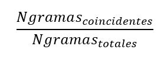

   - Perplexity: Se empleó la métrica Perplexity para evaluar la calidad de las captions predichas. Esta métrica se calcula mediante el cáculo de la probabilidad de las captions predichas del modelo, y mide que tan bien el modelo puede llegar a predecir las siguiente palabras. La fórmula como tal, es la siguiente:

        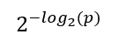

Tal i como se ha mencionado anteriormente, se hizo uso de una métrica adicional en el test, esta métrica es el coefficiente de Jaccbard:
   - Coeficiente de Jaccbard: El coeficiente de jaccbar calcula la similitud entre dos conjuntos, dividiendo la longitud de la intersección por la unión de estos.

{AQUI TENEMOS QUE PONER QUE TODAS LAS METRICAS NOS HAN DADO MAL??? O ESTO VA EN RESULTADOS??}

### Hyperparámetros

Teniendo en cuenta que los hyperparametros base han sido los siguientes:

- Encoder: Resnet50
- Encoder dimension: 2048
- Attention dimension: 256
- Embedding size: 300
- LSTM dimension: 512
- Learning rate: 0.0003
- Optimizer: Adam
- Loss: CrossEntropyLoss


Adicionalmente se han probado diferentes configuraciones:
- Resnet50/101
- Embbedding size
- Attention dimension
- LSTM dimension
- Learning rate: 0.1, 0.01, CyclicLR, LambdaLR

El código, inicialmente venia con la resnet50, pero se quiso probar el modelo resnet101, ya que se pensaba que al haber más capas, el modelo ajustaria mejor los pesos iniciales y de esta forma mejoraría la predicción, pero resultó que la mejoria no era tan significante como para canviar el modelo, y además el tiempo de ejecución augmentaba significativamente respecto al de resnet50, estas dos cosas llevaron a la reflexión de que el modelo resnet50 era suficientemente bueno para el proyecto.

Embbedding size es un parámetro que se usa para representar palabras o letras en un espacio vectorial. Al augmentarlo puede mejorar la representació debido a que permite capturar mas información en los vectores. Y eso ocurrió, se agumentó el embbeding size de 300 a 1024, cosa que propició una mejora en el modelo, debido a que al augmentarlo se capturaron mas detalles y por tanto llevo a una comprensión mas detallada del lenguaje. 

Cuando se habla de attention size se refiere al tamaño de los vectores de atención utilizados. Se utiliza para asignar pesos a diferentes partes de una secuencia de entrada, en este caso, el output del encoder de la imagen. Para ver si el resultado se podía mejorar, se augmentó este, el attention size tiene unas características muy similares al embedding size, por la qual cosa al agumentarlo ocurre lo mismo que con el embbedding size, es capaz de captar mas detalle de lo que le entra.

El LSTM size es el mismo que el decoder size, y este se comporta de la misma manera que los dos anteriores, pero al augmentalo puede tener una complejidad mayor y requerir mas recursos de cómputo, por la qual cosa no mejoraba significativamente el modelo y se obtó por no modificar el tamaño.


El learning rate ha sido el hyperparámetro que mas se ha modificado para ver si habia mejoria o no, se disminuyó, se augmentó e incluso se hizo un learning rate schedule. Con todas las prubas realizadas, se llegó a una conclusión, que el mejor learning rate para el modelo, era el que venia por defector, debido que al augmentarlo overfitteaba, al disminuirlo, no mejoraba al que ya teníamos y al hacer el schedule, se intentaba adaptar al maximo a los datos, que al final no aprendia nada y underfitteaba.

Por tanto, con todo lo que se ha explicado anteriormente, los hyperparámetros escojidos para hacer el mejor modelo posible han sido:

- Encoder: Resnet50
- Encoder dimension: 2048
- Attention dimension: 1024
- Embedding size: 1024
- LSTM dimension: 512
- Optimizer: Adam
- Loss: CrossEntropyLoss
- Learning rate: 0.0003

### Tiempo de entrenamiento y recursos

Se ha cogido el modelo anteriormente explicado y el rendimiento de este durante el entrenamiento con el siguiente hardware ha sido:

Hardware:
- CPU count: 6
- GPU count: 1
- GPU type:  Tesla M60

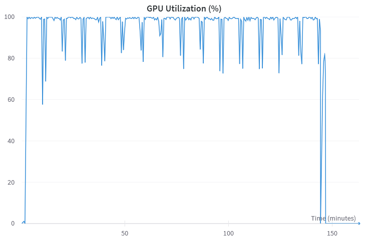

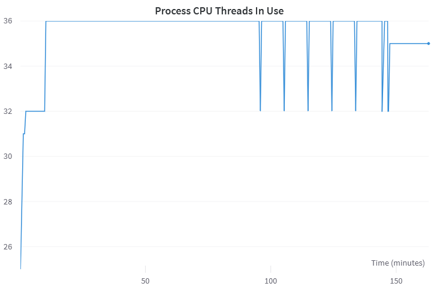

## Results

Después de las varias pruebas explicadas anteriormente estos son los resultados capturados con [wandb](https://wandb.ai/xn14/caption).

### Loss
Los resultados obtenidos de entrenamiento y validación de los diferentes modelos observando la loss:

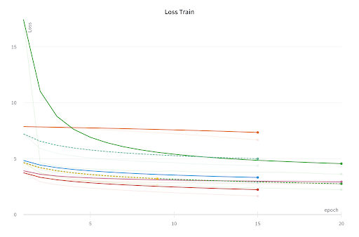

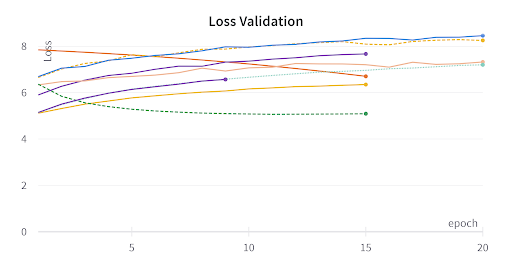

Se puede observar que todos los modelos en la curva de entrenamiento siguen el mismo ritmo de aprendizaje con una curva muy poco curvada pero que va descendiendo excepto para el modelo implementedo con CyclicLR y resnet50, que lo podemos ver como la línea verde en el gráfico. Adicinolamente el modelo con la loss más pequeña es el modelo base modificando embedding size a 1024 y el attention dimension a 1024 marcado en rojo.

Sin embargo, los modelos siguen una naturaleza completamente contradictoria respecto a la validación. Casi todos los modelos tienen una loss ascendiente excepto un par, como por ejemplo el marcado en verde con CyclicLR y resnet50.

### BLEU
Estas son las observaciones del entrenamiento y validación de los diferentes modelos sobre la BLEU score:

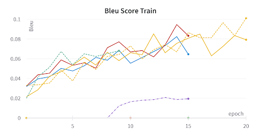

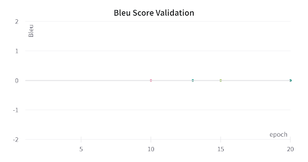

Por lo que respecta a los resultados de BLEU, se han obtenido unos resultados tan bajos debido a que la BLEU se ha calculado con 4-grama (el predeterminado en pytorch). 

Se observa que en entrenamiento todos los modelos siguen una serie ascendente, algunos tardan más en empezar como es el caso del morado. En referencia a las observaciones vista en la loss de entrenamiento, el modelo con embedding size de 1024 y el attention dimension de 1024 marcado en rojo, ha obtenido 0.08 de forma rápida y progresiva a diferencia del resto como puede ser el amarillo que es menos inestable variando de 0.06 a 0.078 de forma muy sucesiva entre epochs. Finalmente se mostrarán predicciones generadas con 15 epochs que ha sido entrenado dicho modelo marcado en rojo.

La BLEU en validación en ninguno de los modelos asciende de 0, esto puede ser por falta de tiempo de entrenamiento, que ya en entrenamiento estamos hablando de hasta 20 epochs y una BLUE inferios a 0.1. Hay que recordar que calculando un BLEU con 4-grama dificulta un buen resutlado en validación.

### Perplexity
Como ya se ha explicado la función y el calculo de la perplexity, estos son los resultados del entrenamiento y validación de los diferentes modelos:

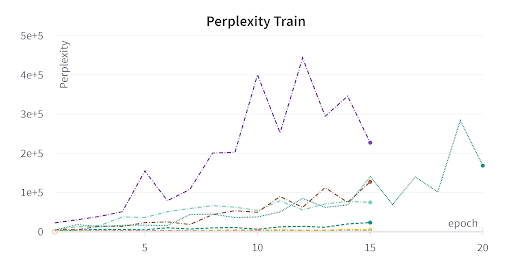

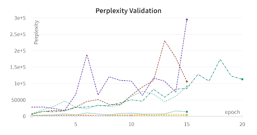

La métrica de Perplexity para entrenamiento y validación no deja de ascender para todos los modelos probados, esto es debido a que cuando los modelos comienzan a ver más datos las probabilidades calculadas para la perplexity disminuyen, aumentando la score final.

### Prediccions
Predicciones con los dos modelos que mejor loss han obtenido:

Modelo: lr=CyclicLR, Optimizador=SGD

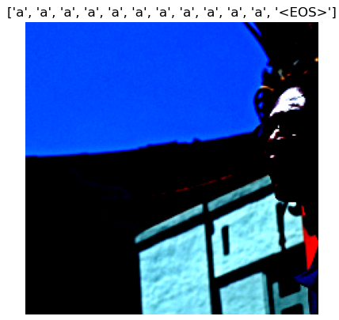

Modelo: embed_size=1024,attention_dim=1024

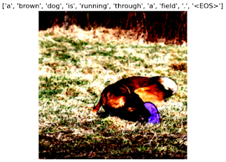

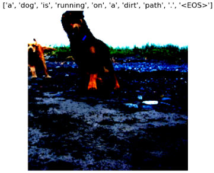

Como observación el segundo modelo sigue la misma estructura de 'a' 'dog' 'running' 'on place'.

### Test

Adicionalmente, se ha comprobado el rendimiento del segundo modelo con imagenes propias:

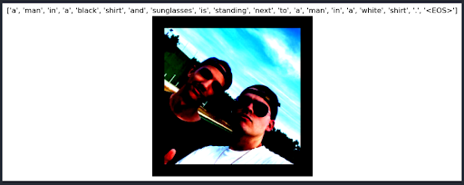

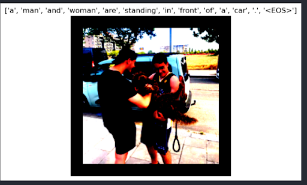

## Possibles mejoras

## Referencias
Algunas de las referencias utilizadas en este trabajo han sido:
- Dataset:
  - [Dataset](https://www.kaggle.com/datasets/adityajn105/flickr8k)
- Start Point:
  - [Code](https://www.kaggle.com/code/mdteach/image-captioning-with-attention-pytorch)
- Optimizadores:
  - [Adam](https://medium.com/ai%C2%B3-theory-practice-business/adam-optimization-algorithm-in-deep-learning-9b775dacbc9f)
  - [SGD](https://towardsdatascience.com/stochastic-gradient-descent-clearly-explained-53d239905d31)
  - [Adagrad](https://towardsdatascience.com/deep-learning-optimizers-436171c9e23f)
  - [Adadelta](https://optimization.cbe.cornell.edu/index.php?title=AdaGrad)
  - [Diferencia entre Adadelta Adagrad y Adam](https://www.i2tutorials.com/what-is-the-difference-between-adagrad-adadelta-and-adam/)
- Métricas:
  - [BLEU](https://pytorch.org/ignite/generated/ignite.metrics.Bleu.html)
  - [Perplexity](https://pytorch.org/torcheval/main/generated/torcheval.metrics.Perplexity.html)
  - [Coeficiente Jaccbard](https://people.revoledu.com/kardi/tutorial/Similarity/Jaccard.html)

## Contributors

- Eric Alcaraz del Pico- 1603504@uab.cat
- Raül Yusef Dalgamoni Alonso - 1599225@uab.cat
- Roger Vera Filella - 1600785@uab.cat

Xarxes Neuronals i Aprenentatge Profund

Grau de Data Engineering,

UAB, 2023
